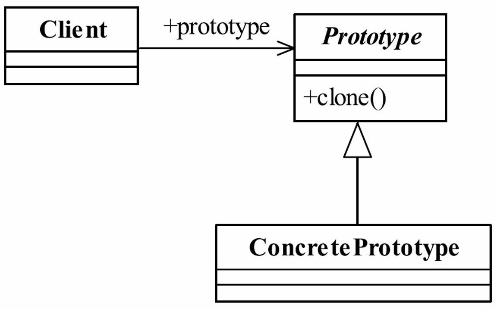

设计模式第七式--原型模式。

##  0x00 原型模式

### 定义
 *Specify the kinds of objects to create using prototypical instance, and create new objects by copying this prototype.* 
 (用原型实例指定创建对象的种类, 并且通过拷贝这些原型创建新的对象。)

<!--more-->

通用类图

#### 优点
+ 性能优良, 原型模式在内存二进制流的拷贝, 要比直接 new 一个对象性能好很多，特别是要在一个循环体内产生大量的对象时。 缺点也是减少了约束。

#### 缺点
+ 逃避构造函数的约束, 直接在内存中拷贝, 构造函数是不会执行的。优点是减少了约束，

#### 使用场景
类初始化需要消耗非常多的资源, 如: 数据, 硬件资源。
1. 性能和安全要求的场景, 通过 new 产生一个对象需要非常繁琐的数据准备或访问权限的情况，可以使用原型模式。
2. 一个对象多个修改者的场景, 一个对象需要提供其他对象访问, 而且各个调用者可能都需要修改其值时, 可以考虑使用原型模式拷贝多个对象供调用者使用。
3. 原型模式可和工厂方法模式一起使用, 通过 clone 的方法创建一个对象, 然后由工厂方法提供给调用者。

#### 注意 
* 构造函数不会被执行
* 浅拷贝和深拷贝
* 要使用 clone 方法， 类的成员变量上不要增加 final 关键字。

#### php 实例 

## 0x01 小结
  原型模式先产生一个包含大量共有信息的类，然后进行拷贝副本(影分身), 修正细节信息, 建立一个完整的个性对象。
<!--more-->
