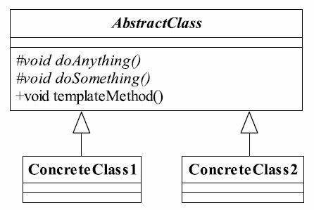

设计模式第四式--模板方法模式。

##  0x00 工厂方法模式

### 定义
 *Define the skeleton of an algorithm in an operation, deferring some step to subclasses. Template Method lets subclasses redefine certain steps of an algorithm without changing the algorithm's structure* 
 (定义一个操作中的算法的框架, 而将一些步骤延迟到子类中。使得子类可以不改变一个算法的结构即可重定义该算法的某些特定步骤。)

<!--more-->

通用类图


#### 优点
1. 封装不可变部分, 扩展可变部分。用不可变部分的算法封装到父类, 可变部分通过继承来扩展。
2. 提取公共部分, 便于维护。
3. 行为由父类控制，子类实现。基本的方法是由子类实现的，因此子类可以通过扩展的方式增加相应的功能，符合开闭原则。

#### 缺点
模板方法模式属于像欧阳峰一样倒练《九阴真经》。正版的《九阴真经》或者一般的武学秘笈开篇应该是提纲挈领, 如独孤九剑，先讲抽象类负责声明最抽象、最一般的事物属性和方法--总决式，然后才娓娓道来破剑式，破刀式，破掌式, 破索式，破鞭式，破枪式，破箭式，破气式这些实现类的具体属性和方法。但是欧阳峰的模板方法模式, 照着黄蓉背给他的倒转的《九阴真经》, 头脚对调了，抽象类定义了部分抽象方法, 有子类实现，子类执行的结果影响了父类的结果, 所以子类对父类产生了影响，结果变得疯疯颠颠的了。“我是谁？欧阳峰是谁？”

#### 使用场景
1. 多个子类又公有的方法, 并且逻辑基本相同时。
2. 重要、复杂的算法, 可以把核心算法设计为模板方法, 周边的相关细节功能则由各个子类实现。
3. 重构时, 把相同的代码抽到父类中，通过钩子函数约束其行为。
4. 具体如: 文件上传; 数据埋点上报等。


#### 注意 
* 为了防止恶意的操作, 一般模板方法都加上final关键字, 不允许被覆写。
* 抽象模板中的基本方法尽量设计为protected类型, 符合迪米特法则, 不需要暴露的属性或方法尽量设置为protected类型。 实现类若非必要, 尽量不要扩大父类中的访问
权限

#### php 实例 

```
<?php
// 独孤九剑
abstract class Dugujiujian {
    // protected 将独孤九剑剑法的招式秘密都保护起来，宁可烂在华山也不轻易传给华山弟子
    protected abstract function zongjueStyle();
    protected abstract function pojianStyle();
    protected abstract function podaoStyle();
    protected abstract function pozhangStyle();
    protected abstract function poqiStyle();

    // final 关键字限定，不能随便改剑谱要诀
    final public function useDujiujian ()
    {
        $this->zongjueStyle();
        $this->pojianStyle();
        $this->podaoStyle();
        $this->pozhangStyle();

        // 如果功力深厚的，再教学破气式
        if(!$this->isGonglishenhou()) {
            echo( '功力不济, 江湖上历练几十年再领会破气式!' . PHP_EOL );
        } else {
            $this->poqiStyle();
        }
    }

    // 钩子方法
    protected function isGonglishenhou()
    {
        return true;
    }
}

class Fengqingyang extends Dugujiujian {
    protected $deepNeili = true;
    protected function zongjueStyle() {
        echo('风清杨在教 总决式' . PHP_EOL);
    }

    protected function pojianStyle() {
        echo('风清杨在教 破剑式' . PHP_EOL);
    }

    protected function podaoStyle() {
        echo('风清杨在教 破刀式' . PHP_EOL);
    }

    protected function pozhangStyle() {
        echo('风清杨在教 破掌式' . PHP_EOL);
    }

    protected function poqiStyle() {
        echo('风清杨在教 破气式' . PHP_EOL);
    }

    protected function isGonglishenhou () {
        return $this->deepNeili;
    }

    // 能不能教学破气式是由内力决定的
    public function checkGongli($deepNeili) {
        return $this->deepNeili = (bool) $deepNeili;
    }
}

class linghuchong extends Dugujiujian {
    protected function zongjueStyle()
    {
        echo('令狐冲在学 总决式' . PHP_EOL);
    }

    protected function pojianStyle()
    {
        echo('令狐冲在学 破剑式' . PHP_EOL);
    }

    protected function podaoStyle()
    {
        echo('令狐冲在学 破刀式' . PHP_EOL);
    }

    protected function pozhangStyle()
    {
        echo('令狐冲在学 破掌式' . PHP_EOL);
    }

    protected function poqiStyle()
    {
        echo('令狐冲在学 破气式' . PHP_EOL);
    }

    protected function isGonglishenhou()
    {
        return false;
    }
}

class chuanshouDugujiujian {
    public static function main ()
    {
        $fengqingyang = new Fengqingyang();
        $deepNeili = 1;
        if(!$deepNeili) {
            $fengqingyang->checkGongli($deepNeili);
        }
        $fengqingyang->useDujiujian();

        $deepNeili = 0;
        $linghuchong = new Linghuchong();
        $linghuchong->useDujiujian();
    }
}

chuanshouDugujiujian::main();

    // 风清杨在教 总决式
    // 风清杨在教 破剑式
    // 风清杨在教 破刀式
    // 风清杨在教 破掌式
    // 风清杨在教 破气式
    // 令狐冲在学 总决式
    // 令狐冲在学 破剑式
    // 令狐冲在学 破刀式
    // 令狐冲在学 破掌式
    // 功力不济, 江湖上历练几十年再领会破气式!
```

## 0x01 小结
使用风清杨教令狐冲独孤九剑的一段经历模拟了一下模板方法模式, 虽然有些生硬，但也是自己对模板方法模式的一个理解吧。反正都要自己去实现一遍, 慢慢消化吸收。哪怕就着芥末吃，也先咽下去。
<!--more-->
